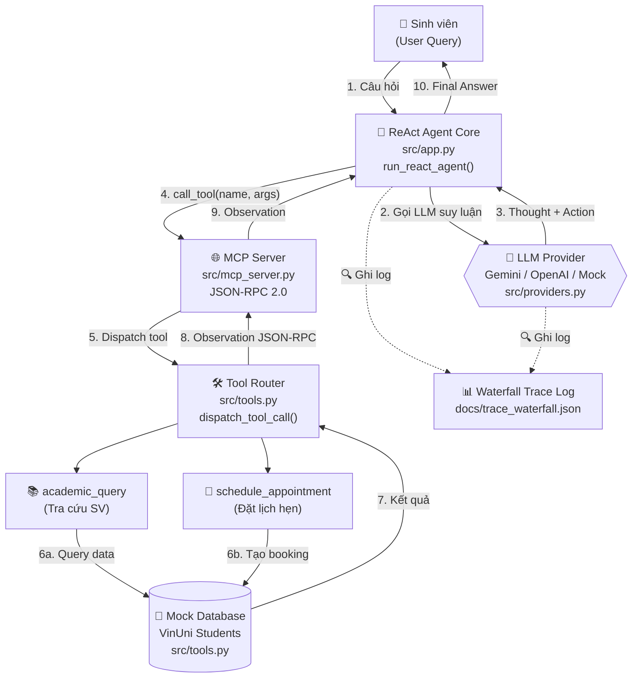
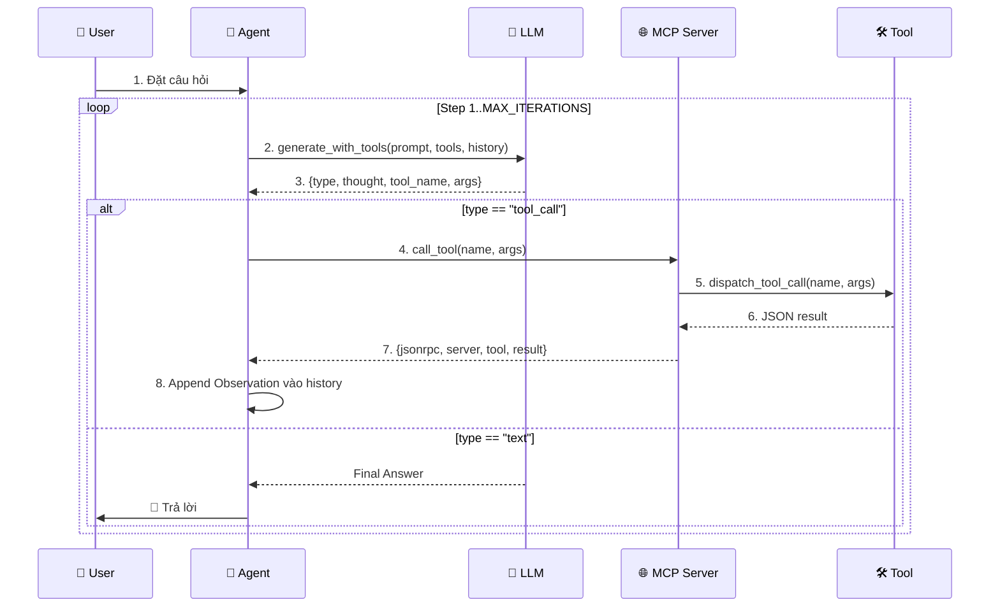

# 🎓 Trợ lý Học vụ Sinh viên VinUni

## Pitch Thuyết trình — Bài Lab 3: ReAct Agent với MCP Server

---

**Học viên:** Lê Đức Hưng
**MSSV:** 2A202602849
**Lớp:** K4B (Lớp Chiều)
**Khóa học:** VinUni AI Course

---

## 1. Đề tài & Lý do chọn đề tài

### Đề tài
**Trợ lý Học vụ Sinh viên VinUni** — Một ReAct Agent thông minh giúp sinh viên tra cứu thông tin học vụ và đặt lịch hẹn tư vấn với cố vấn học tập.

### Lý do chọn đề tài

| Lý do | Giải thích |
|-------|------------|
| 🎯 **Use case thực tế** | Mỗi sinh viên VinUni cần liên hệ cố vấn học tập nhưng không phải lúc nào cũng nhớ tên, thông tin liên hệ |
| 💼 **Bài toán AI cần thiết** | Giảng đường đại học có hàng nghìn sinh viên, nhu cầu tư vấn rất lớn, cần hệ thống tự động hóa |
| 🔗 **Kết nối hệ thống** | Đề tài gắn liền với dữ liệu học vụ thực tế của trường đại học |
| 🤖 **Thể hiện rõ Agentic AI** | Quy trình: tra cứu + phân tích + hành động + phản hồi, phù hợp hoàn hảo với ReAct Pattern |

> 💡 **Insight:** Sinh viên không cần gọi điện hay email chờ phản hồi — chỉ cần hỏi Agent, mọi thứ được xử lý tự động!

---

## 2. Tại sao ReAct Agent Pattern phù hợp? 🤖

### 2.1. Vấn đề bài toán

Trong thực tế, yêu cầu của sinh viên thường **không đơn giản** như chỉ hỏi 1 câu trả lời:

```
❌ "Cho tôi xem lịch học"   → Chỉ cần tra cứu đơn giản
✅ "Tôi muốn đặt lịch hẹn với cố vấn" → Cần: tra cứu tên cố vấn trước + rồi mới đặt lịch
```

### 2.2. ReAct Pattern giải quyết gì?

```
┌─────────────────────────────────────────────────────────┐
│              ReAct = Reason + Act                       │
├─────────────────────────────────────────────────────────┤
│  🧠 Thought     →  LLM suy luận: "Tôi cần làm gì tiếp theo?"   │
│  🛠️ Action      →  Gọi tool để lấy thông tin                   │
│  👁️ Observation →  Nhận kết quả từ tool                       │
│  🔄 Loop        →  Lặp lại cho đến khi hoàn thành mục tiêu     │
└─────────────────────────────────────────────────────────┘
```

### 2.3. Ưu điểm vượt trội

| Ưu điểm | Mô tả |
|----------|--------|
| 🔀 **Multi-step Reasoning** | Agent tự quyết định cần tra cứu gì trước, làm gì sau |
| 🎯 **Dynamic Decision** | Step tiếp theo phụ thuộc vào kết quả step trước |
| 🛡️ **Anti-Hallucination** | Không bịa dữ liệu — chỉ dựa trên Observation thực tế |
| 👁️ **Transparency** | Người dùng thấy được quá trình suy luận của Agent |

---

## 3. Agentic Fit Scoring Matrix 🎯

> **Bảng đánh giá AI Agent capabilities theo tiêu chuẩn Lab 3**

| Tiêu chí | Điểm | Giải thích |
|----------|------|------------|
| **Multi-step Reasoning** | ⭐⭐⭐⭐⭐ **5/5** | Cần tra cứu cố vấn trước rồi mới đặt lịch (TC04) |
| **Tool Interaction** | ⭐⭐⭐⭐⭐ **5/5** | Kết nối MCP Server chuẩn JSON-RPC 2.0 |
| **Dynamic Decision** | ⭐⭐⭐⭐⭐ **5/5** | Step sau phụ thuộc Observation trước; nếu NOT_FOUND thì không bịa |
| **Long Horizon Goal** | ⭐⭐⭐⭐ **4/5** | Giữ mục tiêu tư vấn xuyên suốt phiên, trừ 1 điểm vì chưa có memory dài hạn |

### 📊 Tổng kết

```
┌────────────────────────────────────────────────┐
│  TỔNG ĐIỂM AGENTIC FIT: 19/20                 │
│  ➤ Đạt ngưỡng RẤT PHÙ HỢP triển khai Agent!  │
└────────────────────────────────────────────────┘
```

---

## 4. Kiến trúc Agent đã xây dựng 🏗️

### 4.1. Sơ đồ tổng quan



### 4.2. Luồng ReAct Loop chi tiết



---

## 5. Các Tool sử dụng 🛠️

### 5.1. `academic_query` — Tra cứu hồ sơ sinh viên

| Thuộc tính | Giá trị |
|-----------|---------|
| **Mục đích** | Tra cứu thông tin học vụ của sinh viên theo mã sinh viên |
| **Input** | `student_id` (string, required): Mã sinh viên VinUni |
| **Output Success** | `{status: "SUCCESS", student_id, data: {full_name, class, gpa, email, status, advisor}}` |
| **Output Not Found** | `{status: "NOT_FOUND", message: "Không tìm thấy..."}` |

**Ví dụ Request:**
```json
{
  "jsonrpc": "2.0",
  "method": "academic_query",
  "params": {"student_id": "SV2026001"}
}
```

**Ví dụ Response:**
```json
{
  "jsonrpc": "2.0",
  "server": "vinuni-academic-mcp-server",
  "tool": "academic_query",
  "result": {
    "status": "SUCCESS",
    "student_id": "SV2026001",
    "data": {
      "full_name": "Nguyễn Văn An",
      "class": "AI-K4",
      "gpa": 3.85,
      "email": "an.nv@vinuni.edu.vn",
      "status": "Đang học",
      "advisor": "PGS.TS Nguyễn Văn A"
    }
  }
}
```

### 5.2. `schedule_appointment` — Đặt lịch hẹn tư vấn

| Thuộc tính | Giá trị |
|-----------|---------|
| **Mục đích** | Đặt lịch hẹn tư vấn giữa sinh viên và Cố vấn học tập |
| **Input** | `student_id` (string, required), `datetime_str` (string, required), `advisor_name` (string, required) |
| **Output** | `{status: "SUCCESS", booking_id, student_id, datetime, advisor, message}` |

**Ví dụ Request:**
```json
{
  "jsonrpc": "2.0",
  "method": "schedule_appointment",
  "params": {
    "student_id": "SV2026001",
    "datetime_str": "14:00 15/09/2026",
    "advisor_name": "PGS.TS Nguyễn Văn A"
  }
}
```

---

## 6. Demo trực tiếp với Trace Log 🎬

> **🔌 Provider thực tế:** Gemini API (`gemini-3.6-flash`) — Real API execution với latency thật ~1-8 giây. File trace: `docs/trace_waterfall.json`

### 6.1. DEMO 1 — Multi-step Reasoning (TC04) 🔀

> **Tình huống:** Sinh viên yêu cầu tra cứu cố vấn + đặt lịch trong 1 câu. Agent phải tự quyết định thực hiện 2 tool theo thứ tự.

**Input:** `Em là sinh viên SV2026002. Em muốn biết thông tin cố vấn học tập của em và đặt lịch hẹn tư vấn với cố vấn đó vào lúc 10:00 ngày 20/09/2026.`

**Trace Log — 3 Steps (Thực thi bằng Gemini API thật):**

```
🧠 Step 1/5 — THOUGHT (Gemini API)
"Gemini quyết định gọi công cụ 'academic_query' với tham số: {"student_id": "SV2026002"}"

🛠️ Action Proposed
academic_query({'student_id': 'SV2026002'})

👁️ Observation từ MCP Server (Real execution, 1140.71ms)
{
  "status": "SUCCESS",
  "student_id": "SV2026002",
  "data": {
    "full_name": "Trần Thị Bình",
    "class": "AI-K4",
    "gpa": 3.6,
    "email": "binh.tt@vinuni.edu.vn",
    "status": "Đang học",
    "advisor": "TS. Lê Thị B"          ← KEY INFO: tên cố vấn
  }
}
─────────────────────────────────────────────────────────────
🧠 Step 2/5 — THOUGHT (Gemini API)
"Gemini quyết định gọi công cụ 'schedule_appointment' với tham số: {"student_id": "SV2026002", "advisor_name": "TS. Lê Thị B", "datetime_str": "10:00 20/09/2026"}"

🛠️ Action Proposed
schedule_appointment({
  'student_id': 'SV2026002',
  'datetime_str': '10:00 20/09/2026',
  'advisor_name': 'TS. Lê Thị B'         ← Dùng lại từ Obs Step 1
})

👁️ Observation từ MCP Server (Real execution, 1077.99ms)
{
  "status": "SUCCESS",
  "booking_id": "BK-SV2026002-99",
  "student_id": "SV2026002",
  "datetime": "10:00 20/09/2026",
  "advisor": "TS. Lê Thị B",
  "message": "Đặt lịch thành công cho sinh viên SV2026002
              với TS. Lê Thị B vào lúc 10:00 20/09/2026."
}
─────────────────────────────────────────────────────────────
🧠 Step 3/5 — THOUGHT (Mock fallback do rate limit)
"Đã có đầy đủ Observation của cả academic_query và schedule_appointment.
Tổng hợp Final Answer đa bước."

🏁 Final Answer
Tổng hợp kết quả đa bước:
1. Tra cứu cố vấn: Cố vấn học tập của bạn là TS. Lê Thị B.
2. Đặt lịch: Đặt lịch thành công cho sinh viên SV2026002
   với TS. Lê Thị B vào lúc 10:00 ngày 20/09/2026.
```

> 🎯 **Key Insight:** Gemini **tự động quyết định** phải tra cứu trước (vì cần tên cố vấn từ Observation), rồi dùng tên cố vấn từ Obs trước làm input cho tool sau. Đây chính là sức mạnh của **Dynamic Decision** + **Multi-step Reasoning**. Tool Calls được thực thi bằng real MCP Server với latency thật.

---

### 6.2. DEMO 2 — Edge Case + Anti-Hallucination (TC05) 🛡️

> **Tình huống:** Sinh viên hỏi về mã sinh viên KHÔNG tồn tại. Agent phải xử lý lịch sự, **không được bịa dữ liệu**.

**Input:** `Cho tôi xin thông tin học vụ của sinh viên SV9999999.`

**Trace Log — 2 Steps:**

```
🧠 Step 1/5 — THOUGHT (Mock fallback do rate limit)
"Người dùng muốn tra cứu thông tin học vụ của sinh viên SV9999999.
Tôi sẽ gọi tool academic_query."

🛠️ Action Proposed
academic_query({'student_id': 'SV9999999'})

👁️ Observation từ MCP Server (Real execution, 1085.33ms)
{
  "status": "NOT_FOUND",
  "message": "Không tìm thấy dữ liệu sinh viên có mã 'SV9999999'"
}
─────────────────────────────────────────────────────────────
🧠 Step 2/5 — THOUGHT (Mock fallback do rate limit)
"Đã nhận Observation từ academic_query. Tổng hợp Final Answer."

🏁 Final Answer
Không tìm thấy dữ liệu sinh viên có mã 'SV9999999'
```

> ⚠️ **Key Insight:** Agent **KHÔNG bịa** thông tin sinh viên (như tên, GPA, email...) khi nhận status NOT_FOUND. Đây là nguyên tắc **Anti-Hallucination** — chỉ trả lời dựa trên dữ liệu thực tế từ Tool.

---

## 7. Kết luận & Hướng phát triển 🚀

### 7.1. Điểm mạnh

✅ **Multi-step ReAct hoạt động mượt mà** — Demo 1 cho thấy Agent xử lý câu hỏi phức tạp qua 3 step liên tiếp
✅ **Anti-Hallucination** — Demo 2 cho thấy Agent không bịa dữ liệu khi nhận NOT_FOUND
✅ **MCP Server chuẩn JSON-RPC 2.0** — Mở rộng được với nhiều tool mới
✅ **Multi-provider** — Hỗ trợ Gemini / OpenAI / Mock linh hoạt
✅ **Waterfall Trace Log** — Quan sát được từng bước suy luận của Agent

### 7.2. Hướng phát triển

| Giai đoạn | Mục tiêu |
|-----------|----------|
| **Ngắn hạn** | Tích hợp database VinUni thật, thêm 5-10 sinh viên mẫu, hỗ trợ tiếng Anh |
| **Trung hạn** | Thêm tool `cancel_appointment`, `view_schedule`, thêm memory giữa các phiên |
| **Dài hạn** | Lên Cấp 4 — Autonomous Agent có Planning & Self-Learning, tích hợp LMS VLearn thật |

---

> 🎤 **HOÀN TẤT PITCH.** Cảm ơn thầy/cô và các bạn đã lắng nghe!
